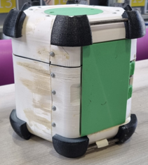
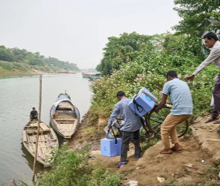
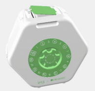
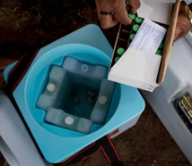
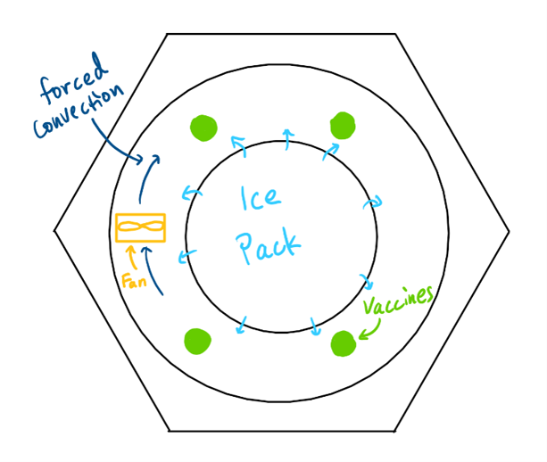
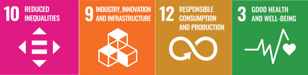
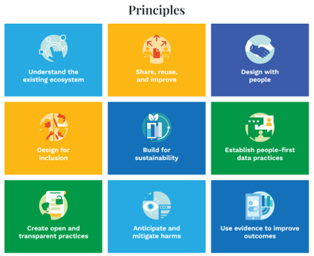

# Context and Summary

Vaccines save millions of lives every year, but they must be kept within a strict temperature range of 2–8°C to stay effective. 
Keeping these temperatures can be very difficult in remote regions where access to reliable electricity and refrigeration is limited, 
and current cooler boxes used for transporting vaccines in the last-mile stage from storage warehouses to remote villages have 
several design flaws that lead to potential vaccine spoilage. To address this, IDEABATIC created the SMILE vaccine carrier, a 
passive cooling system designed to keep vaccines cold during transport to hard-to-reach communities. The most recent prototype 
is the SMILE Go, which is a smaller, lighter version of the original, making it easier for healthcare workers to carry vaccines 
during last-mile delivery.

Our project focused on a cooling issue that had been identified within the SMILE Go. Initial testing conducted earlier this 
year revealed a persistent temperature gradient, where vaccines stored in the upper compartments of the vaccine carousel were 
consistently warmer than those in the lower compartments. The causes of this temperature gradient had not yet been investigated 
on the SMILE Go. Reducing this temperature gradient would optimise performance (keep the vaccines within the required temperature 
range for longer) and provide greater confidence that all vaccines are stored under equal conditions. Thus, this project aimed 
to investigate the variables driving this non-uniform cooling.

 

To understand the cause of this behaviour, our team designed and carried out a series of experiments on the current SMILE Go 
prototype. We assembled a temperature-monitoring system and produced several 3D-printed components to measure how temperatures 
changed throughout the vaccine carrier over time. Several possible explanations were investigated. These included uneven cooling 
within the ice pack, heat entering through the access door, natural movement of air inside the vaccine chamber, and differences 
in how the ice pack contacted its housing.

A baseline test confirmed that the upper compartments could be 6–7°C warmer than the lower compartments. Given that the required 
range of the vaccines is only 6°C, this showed that this cooling non-uniformity was a significant problem. To investigate 
possible explanations, we then modified different aspects of the carrier and compared the results. Some changes, such as altering 
the orientation of the carrier to investigate heat entering through the door, produced very little improvement. Similarly, 
changing the way the ice pack contacted its housing had little effect when tested on its own. More promising results were achieved 
with modifications designed to alter the cooling distribution within the carrier. A 
redesigned insert placed inside the ice pack reduced the temperature difference by approximately 2°C. In addition, the radial 
planes test, which resists natural convection, showed a 1°C improvement. Two separate tests combining modified convection airflow 
pathways with a modified ice pack position (contacting the upper surface of its housing rather than the bottom) and one with 
a cooler insert achieved a similar improvement, suggesting that the non-uniform cooling may be caused by several factors interacting 
rather than a single dominant issue.

Finally, we investigated whether actively moving air inside the carrier could improve temperature uniformity. Using small, 
low-power fans, we found that temperatures became almost identical throughout the vaccine chamber. While this approach may not 
be practical in its current form (due to it requiring electrical power), it demonstrates that improved airflow management could 
provide an effective solution in future designs.

Overall, the project narrowed down the most likely causes of non-uniform cooling. The team developed and tested potential 
improvements and provided IDEABATIC with valuable data to support the development of more effective vaccine delivery systems.

# Sustainable Development Goals and UNICEF Principles for Digital Development 

The SMILE Go project aimed to investigate non-uniform cooling within a vaccine carrier designed to support vaccine delivery 
in remote and low-resource communities. By improving our understanding of the factors causing this asymmetrical cooling, the 
project contributes to the improvement of vaccine storage and transport for these populations. As a result, the project aligns 
with several UN Sustainable Development Goals (SDGs), particularly SDG 3 (Good Health and Well-Being), SDG 10 (Reduced 
Inequalities), SDG 9 (Industry, Innovation and Infrastructure), and SDG 12 (Responsible Consumption and Production).

## SDG 3 – Good Health and Well-Being

The primary objective of the project directly supports SDG 3 by contributing to the safe storage and transportation of vaccines. 
The non-uniform cooling observed within the current SMILE Go cooler could expose some vaccine compartments to temperatures outside 
the recommended storage range, reducing vaccine efficacy. If the temperatures go below zero, the vaccines may freeze and, above 
8°C, can experience breakdown. Through our investigation, the performance can be improved to help ensure that vaccines remain 
effective when delivered to healthcare providers and patients, ultimately supporting public health outcomes and disease prevention.

## SDG 10 – Reduced Inequalities

Access to reliable healthcare infrastructure is often most challenging in remote regions. Transporting vaccines and keeping 
vaccines in the right temperature range remain significant barriers to immunisation in many parts of the world. The SMILE Go 
cooler is intended to provide an accessible solution for vaccine transport in such environments. By improving our understanding 
of the causes of non-uniform cooling, the project provides data to support future design improvements, helping to make vaccine 
storage more reliable, reduce vaccine wastage, and improve access to healthcare for communities that need it most. Improving 
vaccine preservation can help improve the availability of life-saving immunisations for communities, contributing to more equal 
healthcare.

## SDG 9 – Industry, Innovation and Infrastructure

The project used experimental testing to investigate a practical challenge in vaccine transportation. Temperature sensors, data 
logging, and prototyping were used to assess potential causes of non-uniform cooling, including door leakage, ice pack geometry, 
thermal contact, and convection within the vaccine chamber. The use of 3D printing and low-cost electronics enabled potential design 
improvements which could be tested rapidly and at a low cost. The findings identified opportunities for future improvements in the 
cooler design, manufacturing methods, and material selection, contributing to the development of more reliable vaccine transport methods.

## SDG 12 – Responsible Consumption and Production

Vaccines that are exposed to unsuitable temperatures may lose effectiveness and need to be discarded, resulting in wasted resources. 
The project contributes to reducing vaccine wastage and improving the efficiency of vaccine distribution. The project also considered 
material selection and manufacturing methods, highlighting opportunities for more durable and practical designs in future iterations. 
These were also looked at in the context of accessible materials in these areas such as Cameroon. These outcomes support SDG 12 by 
promoting more efficient use of resources and reducing unnecessary waste within healthcare supply chains.

Although the project was primarily focused on thermal testing, some UNICEF Principles for Digital Development were reflected in the 
approach taken. Throughout the project, design decisions and test results were documented and shared within the team, helping to maintain 
continuity and inform future work. This work was conducted in conjunction with our partner Kitty, who has been to Cameroon and provided 
insight into the current challenges faced there. The work completed is uploaded to the public Git repository, keeping the tests open and 
transparent and available for future use. Data collected backs up our conclusions in this project to help inform future design decisions.

# Project Management

The project was managed using a collaborative approach that balanced team decision making with delegating individual responsibility. 
As a team of three, we aimed to distribute tasks as evenly as possible so that each member could contribute meaningfully to the project 
while developing their own technical skills. Big decisions, such as project planning, interpreting results, and choosing which ideas to 
test and their resulting design modifications, were typically made as a group. However, individual team members took ownership of specific 
tasks, such as conducting research, preparing experiments, analysing data, and developing electronics. This approach allowed us to benefit 
from the skills and perspectives of the entire team whilst still keeping clear accountability for individual tasks.

One important aspect of the project for our team was communication. Initially, many discussions took place through a group chat, which was 
helpful for sharing updates and arranging meetings. However, as the project became more technically advanced, it became increasingly 
difficult to communicate ideas, diagrams, and experimental observations through text messages alone. Misunderstandings occasionally arose, 
and technical discussions could become confusing. To address this, we began holding regular face-to-face meetings in the Dyson Centre on a 
near-daily basis. This was convenient during our testing period as the tests often required team members to be present. These meetings 
enabled faster decision-making and provided opportunities to work collaboratively on problems. Looking back, we would recommend scheduling 
regular face-to-face meetings earlier in similar projects, rather than relying on online communication.

Another key factor which helped us effectively run our project was the use of shared documentation. Early in the project, we recognised 
that experimental data, meeting notes, and presentations needed to be accessible to all team members. A shared Google Drive was therefore 
adopted as the central location for storing project information. This ensured that documents could be easily accessed, edited, or reviewed 
by the entire team. The shared repository also reduced the risk of version-control issues that may be present on Git and prevented important 
information from becoming isolated on individual devices. Additionally, all team members were more comfortable working with Google Drive than 
GitHub. Having organised documentation proved helpful during the report-writing stage, when experimental results needed to be reviewed.

The project also highlighted the importance of adaptability. Experimental work did not progress exactly as initially outlined in our Gantt 
chart due to factors such as equipment availability, long freezing times, and unexpected test outcomes. As a team we constantly adjusted 
our schedule and modified test plans where necessary. Additionally, throughout the testing process, we continuously refined our approach by 
identifying additional potential causes and running further tests to investigate them. This flexibility allowed progress to continue despite 
practical constraints and helped ensure that project objectives were still met.

Overall, the project ran smoothly due to our combination of shared decision making, clear task ownership, regular communication, and effective 
document management. For teams undertaking similar experimental projects in the future, we would recommend holding regular face-to-face meetings, 
creating a shared space for documentation, and maintaining flexible plans. We found these practices improved our collaboration and made it easier 
to respond to unexpected developments. 

