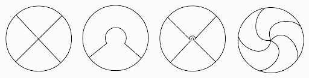
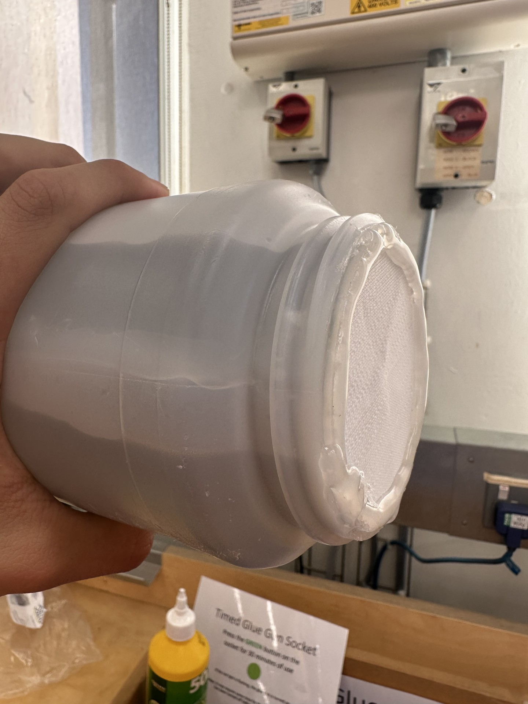
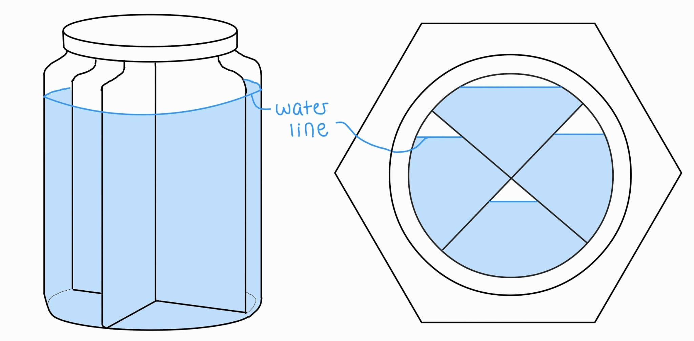
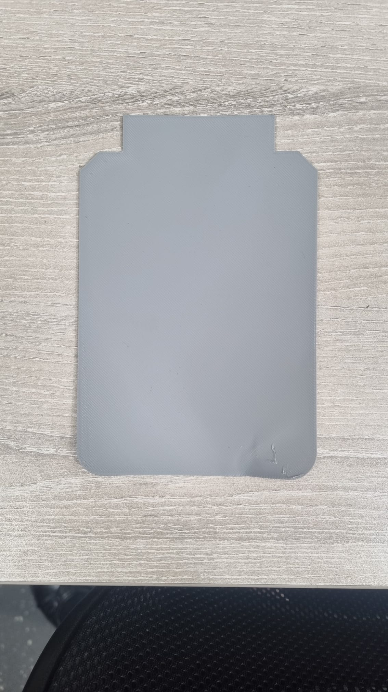
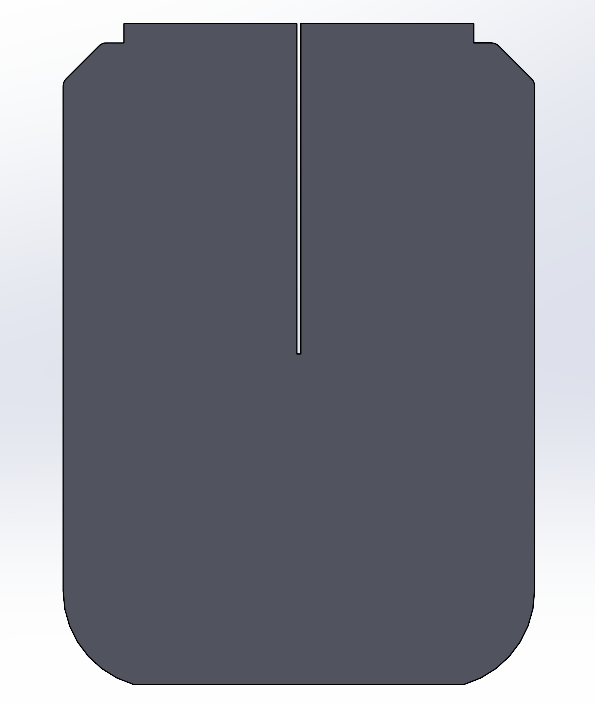
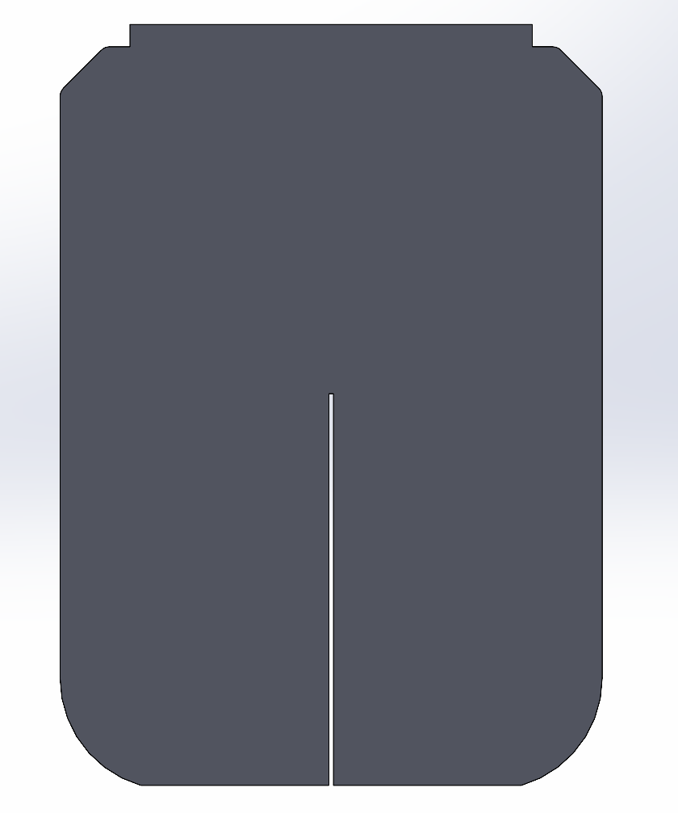

# Technology for the poorest billion

# SMILE GO Project - Uniform Cooling Solutions

Karen Miyazaki | 10 June 2026

## Project Team:

Karen Miyazaki, Kerry Dai, Kavita Sivaraman

## In collaboration with:

Kitty Liao, Oliver Griffiths

# My Contribution

This report documents my contribution to the SMILE GO project, which investigated the causes of non-uniform cooling within the vaccine carrier and explored potential methods to reduce temperature gradients. My primary responsibility was the design, manufacture and evaluation of bottle inserts for the central ice pack. As a team, we all contributed to experimental setup, test execution and analysis throughout the project. Ideas for tests were discussed as a team and set up together upon reaching an agreement.

# Project Overview

The SMILE GO is the scaled down version of the SMILE vaccine cooler created by Kitty Liao’s company, Ideabatic, which helps deliver vaccines to remote and low-resource areas. The cooler is designed to be an affordable and portable solution, making it more suitable where access to reliable refrigeration and healthcare infrastructure is limited such as in Cameroon. The vaccine cooler is required to stay in a 2-8 degree temperature range to maintain the cold-chain. If the vaccines go below 2 degrees, there is a risk of the vaccines freezing and likewise if the vaccines go above 8 degrees, there is a risk of the vaccines denaturing.

However, it was observed that the upper chambers inside the cooler were much hotter than the lower chambers so we aimed to identify the causes of non-uniform cooling within the vaccine cooler and propose mitigation strategies for this. This investigation is crucial to ensure that all vaccines safely remain in range to ensure the vaccines remain effective for a longer period of time. Vaccine wastage can also be reduced, making healthcare delivery more reliable and sustainable in these rural areas. Throughout this project, we collected valuable thermal data that can be used to inform future design improvements.

# Prototyping set-up

## Insert Development

Upon discussion with Kitty, we hypothesized that the ice pack cools unevenly because of the large internal air gap at the top of the ice bottle during melting. Since air has a significantly lower thermal conductivity and heat capacity than water, heat transfer from the upper sections of the bottle to the remaining ice was expected to be less effective, leading to higher temperatures in the upper vaccine compartments.

I designed the inserts to divide the bottle into multiple chambers while maintaining a simple geometry that could be manufactured using FDM 3D printing. I generated multiple insert designs and evaluated them before a final design was selected. The design process focused on balancing thermal performance with practical manufacturing constraints. The insert needed to fit through the bottle opening, maintain sufficient internal volume for the ice pack, and be manufacturable using the available 3D printing facilities. A few packaging methods were considered such as snap-fit inserts, slotted structures or single print structures. These ideas are presented below:

The first design was selected due to its simplicity and reliability. In this set-up, the two planes have slots that physically interlock, allowing the print to be done as two flat planes instead of a thin 3D part. Two planes were sufficient to demonstrate results, while remaining practical to insert into the bottle. As shown in the diagram below, the larger air gap gets segmented into four chambers, so the upper chamber has less insulation from the air in this set up than without the inserts.

However, this design relies on the 3D print being flexible enough to push through the neck of the bottle. Therefore, an initial prototype was produced to verify fit and assembly within the bottle. The inserts were manufactured using PLA through 3D printing. Printing parameters of 100% outer walls and 15% infill provided adequate stiffness while retaining a small degree of flexibility during assembly. This is shown below:

Early testing demonstrated that attaching the insert directly to the bottle lid was impractical due to difficulties associated with the screw closure mechanism. As a result, the design was modified to incorporate a separate printed top section. Two further iterations were completed to refine the dimensions and ensure reliable closure of the bottle. The final design successfully allowed the bottle lid to close while maintaining the required internal geometry. These designs are shown in the CAD models below:

 

Throughout the design process, several practical limitations of this prototyped design became apparent, particularly regarding print porosity and sealing.

## Assembly

A significant challenge encountered was producing a watertight and airtight seal within the bottle. Hot glue was selected as a low-cost and readily available sealing method for prototype testing. Kerry was responsible for hot gluing the insert into the bottle and additional hot glue was applied around the interfaces to minimise leakage. I assisted with this process at times.

Following assembly, the bottle underwent a freeze-thaw cycle prior to experimental testing. The insert and adhesive joints remained structurally sound throughout this process and the final assembly was found to be almost perfectly watertight and airtight.

## Materials research

Throughout the design process, Kerry and I analysed the materials used in this test. Several limitations of 3D printing became apparent, particularly regarding print porosity. Moisture permeation was observed through some printed components caused by microscopic voids and gaps between extrusion lines. This was more significant in the earlier prototype, which was printed using a lower-precision printer. Later prototypes were produced using a higher-quality Bambu Lab printer with 100% top and bottom densities and 15% infill. This improved print consistency, reduced visible porosity, and still retained enough flexibility for the insert to be pushed through the bottle neck during assembly. Over time, this may still pose as a concern.

PLA was suitable for rapid prototyping because it was cheap, quick to manufacture, readily available in the Dyson Centre, and allowed complex geometries to be produced easily. However, it is not ideal for long-term use in the SMILE GO cooler. The material PLA itself can absorb moisture over time and may undergo hydrolytic degradation in water. Repeated freezing and thawing may also cause the absorbed water within the print to expand and contract, potentially opening cracks or weakening the interfaces between printed layers. For the short duration of our prototype testing, these limitations were acceptable, but they would be problematic for a cooler intended to last for several years.

Sealing the inserts inside the bottle also presented practical difficulties. Hot glue was selected because it solidified quickly, was low cost, and could be removed relatively easily, making it suitable for iterative prototype testing. However, it is not a reliable long-term sealing method. The bottle is made from polyethylene, which hot glue only bonds to weakly, and the adhesive may become more brittle during freezing. Repeated freeze-thaw cycles could therefore cause the hot glue to debond from either the PLA or the bottle wall, allowing water or air to pass between chambers.

I identified PETG as a more suitable material for future 3D printed prototypes, as well as for the carousel that becomes wet due to condensation. It has lower water absorption than PLA, is more water resistant, and is less brittle at low temperatures. This would make it better suited to a water-filled component undergoing repeated freeze-thaw cycles. However, PETG was not available in the Dyson Centre during the project, so PLA remained the most practical option for the tested prototypes.

Alternative sealing methods were also considered. Epoxy coating could improve the waterproofing of printed PLA parts, but its long curing time made it unsuitable for our project timescale. I identified silicone sealant to be more appropriate for long-term sealing because it remains flexible at low temperatures and can better accommodate differential thermal expansion between the bottle and the insert. However, its curing time is also much longer than hot glue, so it was less convenient for rapid prototyping.

Overall, the insert design was suitable as a proof-of-concept prototype, but not as a final production solution. For small-scale use, improved 3D printed inserts using PETG and a more durable sealant could be investigated. For larger-scale manufacture, a more robust approach would be to eliminate the separate inserts and adhesive joints entirely by producing a bottle with integrated internal chambers, for example through extrusion blow moulding or stretch blow moulding. This would improve durability, watertightness and reliability over the intended service life of the cooler.

# Testing

The electronic set up to obtain data from four temperature sensors was made by Kavita, where two probes measured the upper compartments and two measured the lower compartments. A control test was conducted with the original set up to serve as a baseline for our tests.

As a team, we thought of potential reasons for the asymmetrical cooling and subsequently set up experiments together to run. These tests and results can be found in the “Test Results & Analysis” document. Other than the insert test, the test demonstrating the effect of the base of the ice pack in contact with the carousel was conducted by inserting small sticks into this gap. To understand the role of convection in the thermal data, ten cardboard radial planes were used and slotted into the carousel. The edges were sealed by duct tape to ensure no air could pass between the compartments on the carousel. The tests evolved as we obtained data so the inserts, convection planes and sticks had to be put on multiple times. Each was compared against the control tests 1 and 2 depending on the ambient temperature in the experiment.

The insert was subsequently incorporated into the combination tests alongside other mitigation strategies. These combined approaches produced further reductions in temperature difference compared to the insert alone, suggesting that multiple factors contribute to the observed non-uniform cooling.

# Results

The insert test demonstrated that partitioning the ice pack into multiple chambers reduced the temperature difference within the vaccine compartment. At 12 hours, the temperature difference between the warmest and coolest measurement locations decreased from approximately 7.2°C in the control test to 5.3°C with the insert installed, representing an improvement of around 2°C. The results suggest that the distribution of ice, meltwater and air within the bottle influences the overall cooling behaviour of the SMILE GO cooler. The graphs can be seen in the “Test Results & Analysis” document attached in this github.

Although the improvement was significant, substantial temperature differences remained throughout the test. This indicated that the air gap within the bottle was not the sole cause of the non-uniform cooling. The ambient temperature also fluctuates during the experiment, affecting the temperature within the carousel. The insert therefore reduced the severity of the problem but did not completely resolve it. This is in-line with our hypothesis.

The inserts were subsequently incorporated into the combination tests alongside other modifications, including improved thermal contact and radial planes intended to reduce convective air movement. These combined interventions produced greater improvements than the insert alone, suggesting that multiple heat transfer mechanisms contribute to the observed temperature gradients. This finding indicates that future design improvements should consider the combined effects of ice pack geometry, thermal contact and convection rather than treating each factor independently.

The in-depth data and analysis of the remaining tests are in the [Test Results & Analysis](final/Test results & analysis.md) document attached.

# Conclusions

The objective of the insert development programme was to investigate whether segmentation of the ice pack could reduce the non-uniform cooling observed within the SMILE GO vaccine carrier. The results demonstrated that the insert successfully reduced the temperature difference between the warmest and coolest regions of the vaccine chamber, improving cooling uniformity by approximately 2°C compared to the control test. This supports the hypothesis that the internal geometry of the ice pack influences the thermal behaviour of the cooler.

However, the inserts did not eliminate the asymmetry entirely. Subsequent testing showed that additional mechanisms, particularly natural convection within the vaccine chamber and the thermal interaction between the ice pack and carousel, also contribute to the observed temperature gradients. The insert should therefore be considered a partial mitigation strategy rather than a complete solution. This reinforced the need to investigate additional mechanisms such as convection within the vaccine chamber and the thermal contact between the ice pack and carousel.

The project also highlighted the importance of considering manufacturability alongside thermal performance. Although PLA inserts and hot glue seals were suitable for rapid prototyping, several limitations were identified regarding porosity, moisture absorption, durability and sealing reliability. These factors are unlikely to significantly affect short-term testing but would present challenges for long-term deployment.

Overall, the insert programme provided valuable evidence that modifications to the ice pack can improve cooling uniformity and contribute to a broader understanding of the mechanisms responsible for non-uniform cooling within the SMILE GO cooler.

# Recommendations

The insert concept demonstrated sufficient promise to justify further investigation. Future work should investigate alternative insert geometries and chamber arrangements to determine whether greater improvements in cooling uniformity can be achieved. Additional testing should also be conducted to evaluate the influence of chamber size, air gap distribution and amount of 3D print used on thermal performance.

For future prototypes, PETG should be considered in place of PLA due to its improved water resistance, lower moisture absorption and better resistance to low-temperature embrittlement. Alternative sealing methods such as silicone sealant should also be investigated to improve durability during repeated freeze-thaw cycles.

Further testing should be performed under more controlled environmental conditions and over longer timescales to better replicate real operating conditions. Repeated freeze-thaw cycling would be particularly valuable for assessing the long-term reliability of both the insert and the sealing method. The cooler used for the test was broken from long-term use and drop-tests, so using a better sealed cooler would be useful.

