# Technology For the Poorest Billion - Individual Report
## IDEABATIC – Uniform Cooling Solutions 
## Kerry Dai (with Kavita, Karen and working with Kitty and Oliver) 
## Introduction 
Vaccines are used all over the world to save lives and must be kept within a temperature range of 
2-8C to remain useful. In some areas such as rural Cameroon, it is difficult to maintain the strict 
temperature requirements for the vaccines, and cooler boxes must be used for the last mile of 
the delivery of the vaccines to remote locations. IDEABATIC created the SMILE vaccine cooler 
box, a cooling system designed to keep vaccines cold during transportation. The SMILE Go is a 
prototype designed to be a smaller, lighter, and easier to carry version of the SMILE.  
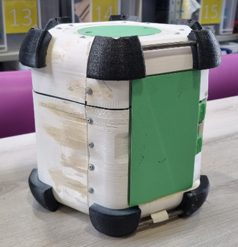
 
In previous testing, it was discovered that there is present an asymmetric cooling effect in the 
SMILE Go, where the upper vaccine compartments are warmer than the lower sections. This 
project aims to investigate and explore the reasons why such a temperature differential exists, 
and to offer suggestions as to what possible ways it can be mitigated.

## Technical Progression 
### Direction  
This step in this project involved extensive research and brainstorming into the different ways to 
approach investigating the non-uniform cooling. As a team, it was initially decided that two main 
branches of exploration were the most promising – bottle inserts, which were strongly suggested 
by Oliver and Kitty as an interesting path to conduct research, and convection, which the team 
was interested in looking at. As the project progressed, new information and ideas surfaced, 
changing the testing schedule and allowing the team to diversify what variables were examined. 
For example, noticing that the ice pack did not sit completely flush in the housing gave the team 
inspiration to test the cooler when the ice pack was pressed into the upper surface of the cooler 
rather than letting it sit on the bottom.  

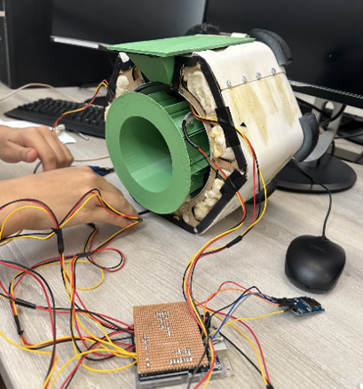

### Experimental Set-up 
The project involved extensive temperature sensing to navigate the testing. Much credit is due for 
Kavita, who managed to handle the electrical side of this project, soldering temperature sensors 
to the Arduino board and writing the code for the testing.  
 
Five temperature sensors were used, four of which were placed in the vaccine chamber (two 
upper and two lower) while one was kept outside in the ambient air. Wires were stripped of their 
outer insulation, in order to fit them between the gaps in the cooler box when assembled. The 
Arduino was connected to a PC in the Dyson Centre, which is constantly powered and can keep 
the tests running overnight if needed.  

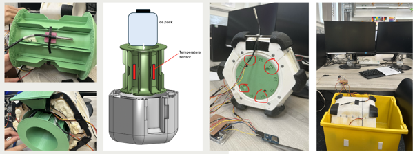
Credit to Kavita for putting this series of images together. 

The vaccine carrier/cooler box was then placed in a waterproof tub, to ensure any faults in the 
set-up which caused water leakage wouldn’t come into contact with the electrical components.

### Testing 
Testing involved many different set-ups: 
• Control Test (no modifications to the original design) 
• Bottle Inserts – PLA 3D printed sheets were printed and hot glued inside the bottle to 
segment the inside of the bottle into four separate, airtight sections. 
• Door Test – The door side of the vaccine carrier was relocated to the bottom side, rather 
than the top, which was the designed position. 
• Improved Contact Test – The ice pack/bottle was lifted, within its housing, so that better 
contact was made with the top surface of the housing. 
• Convection Test (Radial Planes) – Card cutouts were pressed into the vaccine chamber 
spaces. 
• Combination Test 1 – Radial planes set-up in addition to improved contact set-up. 
• Combination Test 2 – Radial planes set-up, bottle insert added, in addition to improved 
contact set-up. 

The above tests were intended to be used to narrow down the reasons for the asymmetrical 
cooling and to see how much of the phenomenon was attributed to each factor that the team 
intended to test. More detail is given about the tests and the reasoning behind the tests in the 
Results and Discussion section of this report. 

Further tests were conducted with hypotheses surrounding how the asymmetric cooling issue 
could be mitigated. These tests were more solution-oriented and did not necessarily narrow 
down the search space for the source of the non-uniform cooling. 
• Fan Test – Low powered electrical fans inserted into vaccine chamber. Credit to Tom 
Bashford during the Project Proposal presentation for suggesting this idea. 
• Vertical Test – Vaccine carrier oriented in the vertical direction, rather than horizontal. 

### Inserts Research 
To make a complete assessment of the implications of our insert tests, research was conducted 
by Karen and I into the materials properties of PLA and our insert sealing methods. 

The idea behind creating inserts is that the non-uniform cooling could be caused by the non-
uniform ice, water, and air distribution within the ice pack itself as it melts, since each phase 
has a different density and buoyancy. Thus, by more evenly distributing the phases within the 
bottle, the asymmetry could be mitigated. 

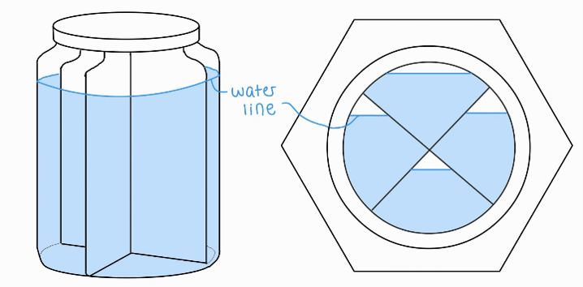
Credit to Karen for making this cooler insert diagram. 

The cooler inserts were manufactured from 3D-printed PLA due to its low cost, quick 
prototyping ability, and low-cost complexity. While useful for experimental testing, several 
limitations were identified. PLA can become brittle at low temperatures and may degrade over 
time through repeated freeze-thaw cycles and water absorption. The layer-based nature of FDM 
printing also creates microscopic voids, reducing waterproof capacity and airtightness (over 
long time periods). In addition, the hot glue seals used to bond the inserts to the bottle were 
good for short term prototyping but aren’t able to provide reliable long term performance due to 
their structural weakness and delaminating. The Bambu printer produced higher-quality print 
consistency and reduced porosity compared to the cheaper printers at the Dyson Centre. For 
future testing, materials such as PETG could improve waterproofing and low temperature 
durability. Sealants such as epoxy coatings or silicone could provide enhanced waterproofing. 
For large scale production, an easier manufacturing approach such as blow moulding would be 
used, as it would eliminate manually sealed joints and create a more durable, airtight and 
watertight bottle for the vaccine cooler. 

### Gluing Inserts 
As part of the insert tests, a watertight and airtight seal was required between the interface of the 
PLA inserts and HDPE bottle/ice pack. The team delegated this part of the work to me.  

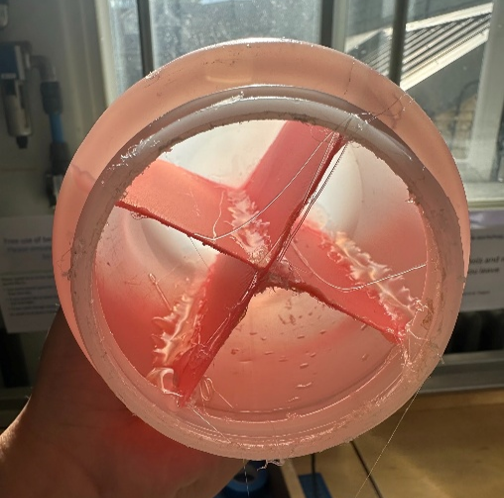
Prior to any testing being done, while the electronics were being put together by Kavita, a sample 
insert was printed (credit to Karen for all 3D printing). This was used by me to trial a hot gluing 
sample. It was a very important step in the insert testing process as it allowed the team to get a 
better grasp on the process which would take much time during the length of the project, over 
two separate tests.  

For possible future prototype testing and for handover information, listed below are suggestions 
on the hot gluing process. 
• Seals are best made using one continuous hot running pool of glue rather than repeated 
heat-cool cycles.  
• Using probes or tools to move the glue is impractical – it is far too adhesive and will stick 
to the tool and hinder the formation of a smooth seal. 
• The hot glue gun is too large to enter the spaces that the bottle and insert creates – gravity 
must be used to direct the glue to the appropriate interfaces. 
• Iterative, regular testing should be conducted as the gluing process is occurring, to 
identify locations of any leaks in the seal. 

The hot glue is an effective sealer for testing purposes as it remained structurally intact after a 
freeze-thaw cycle, while also retaining water/air proofing capabilities throughout the test cycle. 
 
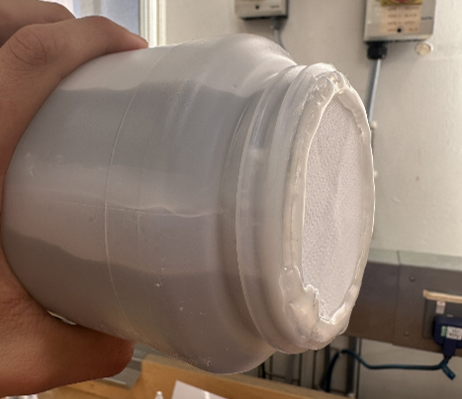

###Convection 
A hypothesis regarding the non-uniform cooling is that it is the natural convection of the air within 
the vaccine chamber that is causing the hot air to rise to the top of the chamber while the cool air 
that is generated at the top of the chamber falls to the bottom. This leads to a temperature 
differential that is reflected in the data collected by Kitty and Oliver in their previous experiments, 
where the chambers near the top of the cooler are warmer than those at the bottom.

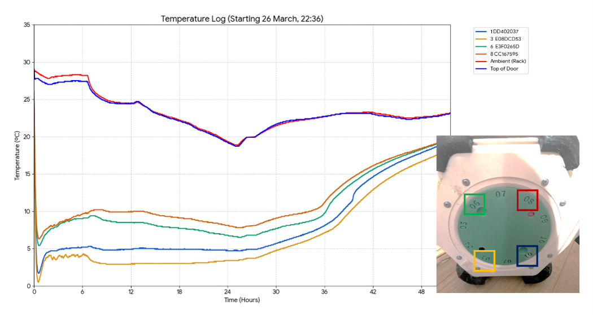
 
The convection testing side of the project was directed much by me, especially the research, but 
Karen and Kavita both contributed great input in putting the test together. In general, the testing 
portions of the project were performed very much collaboratively as a team. 

Notice in the data that the non-uniform cooling effect is instantaneous. If the source of the 
problem were related to the ice distribution within the bottle, perhaps it would be expected that 
the temperatures initially start out relatively identical, since the ice has not melted enough to 
have a significantly uneven distribution within the bottle. In this case, once the ice starts to melt, 
it would be expected that the temperatures differentiate as the water-ice-air ratio evens out 
(creates more non-uniformity).  

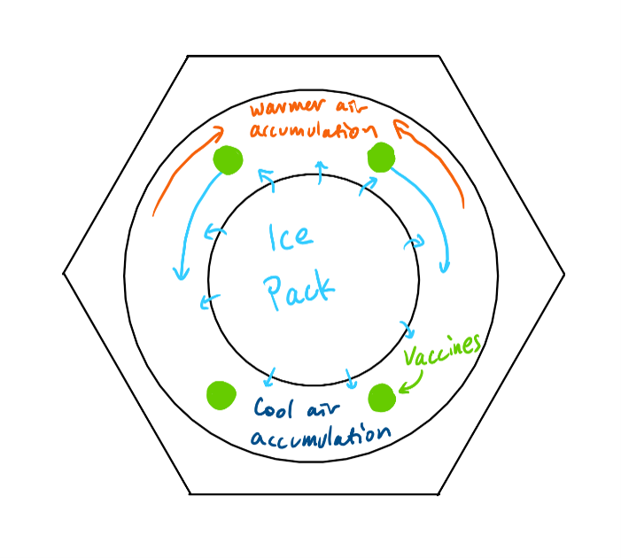
 
However, consider that it is convection that causes the temperatures to be different. The natural 
convection effect is, on the timescales of the experiment, much faster, as the cooler air generated 
at the top surface convects to the bottom of the chamber quickly. The transient motion of the air 
falling is unlikely to occur on the timescale of hours. Thus, we expect a temperature difference 
between the top and bottom of the chamber as soon as the experiment has started. 

#### Methodology 
Experimentally, there are two ways that were proposed to mitigate the temperature gradient 
caused by natural convection within the vaccine chamber. 
##### Stop the flow (Radial Planes) 
To stop the flow of air around the chamber, add radial planes that stretch from the inner radius of 
the vaccine chamber to the outer radius, and extend from the front to the back end. These planes 
should be as well-fitting as can be reasonably constructed, to best resist the flow of hotter air to 
the top section, and the flow of cooler air to the lower sections.  

Some air gaps will still exist, which will decrease the effectiveness of stopping the convection. 
However, it may be such that the radial planes are effective enough to create more uniform 
cooling.  

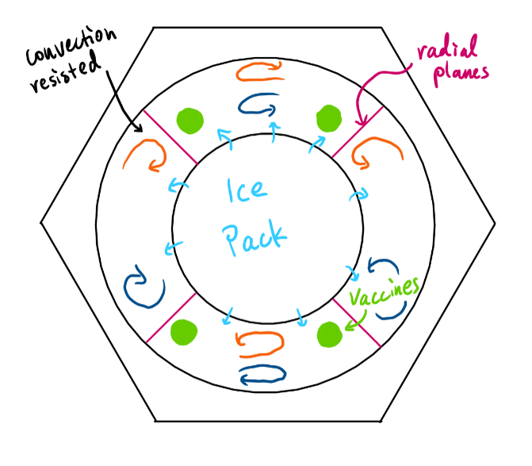
 
From research, if taken to a much smaller scale, this is how insulation works. For example, 
fibreglass insulation creates a fine web of fibres, which traps air into very small pockets and 
resists its flowing motion. This convection design essentially makes use of this principle, but on 
a larger scale.  

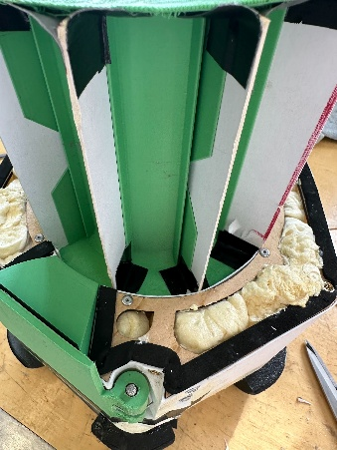  
 
The experimental set-up utilised ten thick pieces of card cut into slightly oversized planes, which 
were inserted into existing slots on the vaccine carousel, and taped to ensure better airproofing. 
Being slightly oversized meant that the entire carousel needed to be forced into the vaccine 
chamber, which slightly frayed the ends of the card and applied pressure between the card and 
the PLA – crucially creating something like a moulded seal along the edge of the planes. P-shaped 
foam seals were used at one end of the vaccine carrier where the seal had a large gap. 

###### Radial Plane Effectiveness 
A test was conducted to see how well the radial planes stops cold air from falling into lower 
sections of the chamber. Ice cubes were placed in the very top of the vaccine carousel, and 
temperature readings were taken over time to assess the rate at which the lower sensors would 
cool, compared to the sensors nearer the top of the chamber (closer to the ice). This was 
compared to the same experiment, but where no planes are present.  

A towel was placed in the central section of the box where the ice pack normally sits. This is to 
stop any convection currents in that region from cooling the lower section of the vaccine cooler 
box affecting the results. 

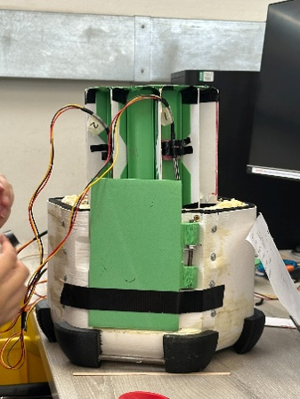
 
After 100 minutes of testing with the radial planes present and the ice at the top of the carousel, 
the bottom two sensors did not show a large temperature drop at all, however the top sensors 
did show a decent drop in temperature. Without the radial planes, the lower sensors did show a 
drop in temperature. This suggests that the planes are effective over some time at stopping the 
cold air generated from the ice from falling quickly to the bottom of the chamber. The 
meaningful quantification of this change requires more extensive testing and analysis, but it 
provided enough information for the team to progress.  

##### Force the flow (Forced Convection) 
By using a small fan, the air within the vaccine chamber can be forcefully convected and kept 
more uniform. This would keep all the positions of the vaccine in air of the same temperature, 
roughly, and eliminate the non-uniform cooling effect, if the temperature difference is truly 
present in the air (rather than, for example a conduction pathway or radiation from the ice pack, 
which is unlikely). 

One caveat to this test is that the fan may cause its own heating from the electrical components 
that run the fan. This effect can be mitigated by running the fan intermittently, which prevents it 
from overheating.  

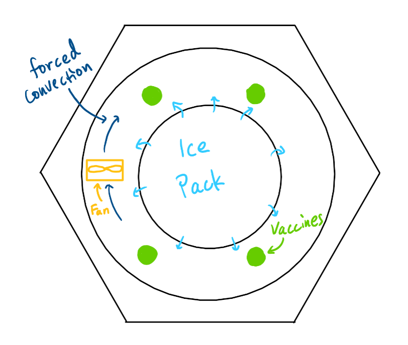

It is critical to note that this test is more solution-oriented, rather than aiming to identify the 
source of the non-uniform cooling. This is because the fan effectively hides or covers the non-
uniform cooling’s source by mixing all the air together, regardless of where the cooler/warmer air 
has come from. For example, if the asymmetric cooling effect stems from an uneven ice 
distribution within the ice pack, a forced convection test would still theoretically result in more 
uniform cooling since the air in the vaccine chamber is forced to mix. 

###### Fan Issues 
The Arduino board is not able to handle the current draw of even very small fans, which require 
at least 80 mA of current whereas the Arduino itself can supply only a maximum of 40 mA. An 
external power supply would be required to power the fans, possibly connected to a relay which 
is then controlled by the Arduino. This would mean that the fan can be kept running 
intermittently to avoid heating the vaccine chamber from the fan’s electrical components.  

However, looking into the case where the use of a fan might be considered in the field, the fact 
that it has a requirement of a power supply beyond that of the Arduino increases the electrical 
complexity and thus cost of manufacture of the SMILE Go. Perhaps with the addition of further 
electrical functionality for the SMILE product, such as the temperature predictor and monitor 
display project by a 2024 team, a fan could be integrated easily. However, for the purposes of 
this project, the electronic complexity of this system is slightly beyond the scope, with the main 
focus being using our existing capabilities to investigate the non-uniformity of the cooling to the 
best of the team’s ability. 

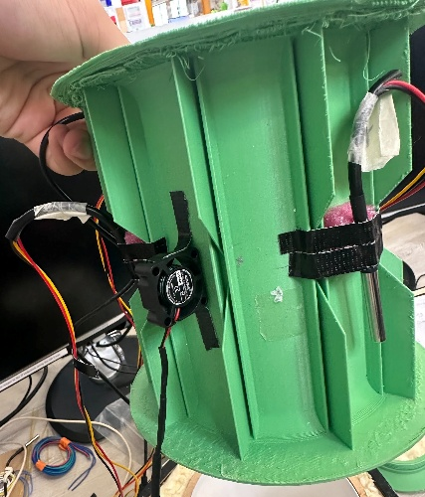

An alternate solution that was considered is using a USB-powered fan for the convection test. In 
this case, the fan would be completely isolated from the Arduino and temperature sensor 
circuit, drawing power from a USB port elsewhere. USB ports cannot generally be controlled to 
be turned on or off, so the fan would be running continuously - likely generating heat and 
affecting the cool-life of the vaccines. However, the heat generated would theoretically be 
distributed evenly throughout the vaccine chamber due to the forced convection from the fan. 
This allows the project to still investigate the relative temperatures of the vaccine holder 
locations and assess the uniformity of the cooling. This ultimately was the experimental set-up 
used.  

### Results and Discussion 
The results showed some promising results despite a few uncontrollable factors that were 
present during the testing phase of the project. These include the ambient temperature – the first 
control test result was taken in an environment exceeding 25C, but following tests showed 
ambient readings nearer 20C. Thus, a second control test was conducted at around 20C for better 
comparisons.  

For specific test results and analysis, please refer to the ************** document attached in 
the Git repository. 

To note some interesting observations made from the *********** document: 
• For most tests, the temperatures within the vaccine carrier seemed to plateau to a 
consistent value after a few hours (5-7) once the initial transient cooling dip passed. This 
is why some tests were run for shorter periods of time (as well as giving the team much 
needed time to run further tests). It is noted that the ice pack was frozen in the materials 
laboratory freezer in the Engineering Department, for which the temperature is not known 
– thus, the initial transient effects that cause the sensors to dip to a very cool temperature 
may be attributed to the ice pack being colder than in Kitty’s testing. 
• The fan test effectively eliminated non-uniform cooling within the vaccine carrier. The 
data collected acts as a proof of concept for a solution which would mitigate the 
asymmetry investigated in this project. 
• A number of tests on individual factors resulted in small improvements of temperature 
differences, but the tests which involved a combination of factors, such as radial planes 
as well as improved contact of the ice pack, showed more promising results and smaller 
temperature differences than observed in other tests. This suggests that the interactions 
between different factors tested are important to consider and contribute to the non-
uniform cooling effect.  

### Further Testing and Possible Design Solutions 
Although the testing in this project provided valuable insights into the causes of non-uniform 
cooling within the SMILE Go, further work is required to validate and expand upon these findings 
to make effective conclusions. Future experiments should be conducted under more tightly 
controlled conditions, with multiple repeat tests and a regulated ambient temperature 
environment to improve the reliability and validity of the results. Longer duration testing across 
the full cooling cycle would help determine whether the observed temperature gradients persist 
over time and whether the changes made per test have an effect in the long run. Additional 
investigations could explore a wider range of ice pack insert geometries, repeat the convection 
experiments with a fully airtight seal, and assess the impact of wear and damage to the cooler, 
particularly around the door where gaps seemed to develop following repeated use and from 
previous year’s drop testing. It would also be valuable to compare chamber air temperatures with 
temperatures measured directly inside vaccine vials, providing a more representative 
assessment of the conditions experienced by the vaccines themselves. Finally, an investigation 
into the insulation and its effect on the cooling phenomenon could be interesting – this is not 
something the team focussed on during this project. For example, does the foam insulation 
porosity play into the cooling behaviour significantly? Will thicker insulation in certain areas 
mitigate the temperature difference better? This is implemented in IDEABATIC’s SMILE version.

The results obtained during this project also suggest several potential design improvements. 
Since the current insulation is sometimes insufficient to consistently maintain the required 2–
8°C temperature range, additional insulation could be included, particularly in the upper sections 
of the carrier where temperatures were higher. Alternative ice pack configurations, such as the 
use of multiple ice packs positioned at different locations within the carrier, may also help 
improve temperature uniformity. Improvements to the fit between the ice pack and its housing 
could reduce air gaps and create more consistent thermal contact. Furthermore, promising 
results were observed when the carrier was oriented vertically and show that a vertical design 
could be considered in future designs if further testing showed promise. Finally, the forced 
convection experiments showed that improved airflow mixing has the potential to almost 
eliminate cooling asymmetry. This makes it a particularly promising direction for future 
development. 

## Conclusion 
This project investigated the sources of non-uniform cooling within the SMILE Go vaccine carrier, 
where the upper vaccine compartments were found to be warmer than the lower compartments. 
Through experimentation, several potential causes were tested, including uneven ice pack 
cooling, natural convection, door heat entry, and improved thermal contact between the ice pack 
and its housing. 

The results confirmed that non-uniform cooling remained present throughout testing, with 
baseline temperature differences of around 5°C between the upper and lower compartments. A 
significant improvement was achieved using a 3D-printed insert designed to redistribute the ice, 
water, and air within the ice pack, reducing the temperature difference by approximately 2°C. In 
contrast, the door orientation, convection, and improved-contact tests produced only minor or 
no improvements when performed independently. However, combining multiple modifications 
resulted in a reduction in temperature difference of about 1.5-2C, suggesting that the asymmetry 
in cooling could be caused by several interacting factors rather than any single mechanism. This 
is something to be looked into further. 

The forced convection experiments produced effectively uniform temperatures throughout the 
vaccine chamber, showing that airflow mixing may provide an effective solution for mitigating the 
temperature difference. This project also emphasises the issues of the overall thermal 
performance of the smaller vaccine carrier, as temperatures occasionally fell below the 
recommended vaccine storage range during the early stages of cooling, and sometimes even 
plateaued to a temperature above 8C. 

Overall, the project identified and evaluated several potential causes of non-uniform cooling, 
suggested promising mitigation strategies, and provided recommendations for future testing and 
design improvements. While a conclusive cause was not identified, the project offers a strong 
foundation for future development of the SMILE Go vaccine carrier. 

The project was supported by strong teamwork and collaboration between all team members. All 
technical decisions were discussed and agreed upon collectively, making sure that different 
perspectives were considered throughout the project. Tasks were delegated efficiently according 
to project needs and individual strengths, so work could progress in parallel while keeping a high 
level of communication and coordination across the team. 

##### References and Accreditation 
❖ ChatGPT was used for grammatical and editorial purposes for this report.  
❖ IDEABATIC Git Repository information was used. 
❖ Previous years’ work on the same project was used. 
