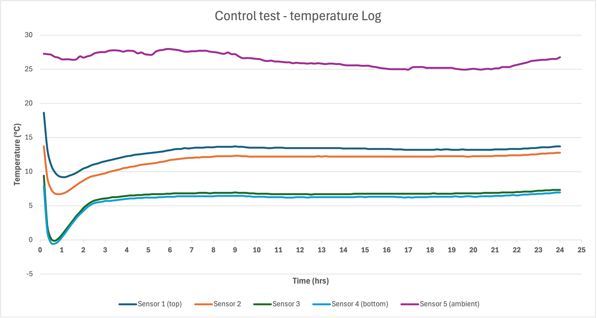

**Test Results & Analysis**

**Control test** 

Ambient temperature: 25-27°C
Temperature difference (once stabilised): 7°C
Notes: 
Bottom compartments went below 0°C
Once stabilised, top compartment chambers well above required 8°C

**Test setup**

For the control test, the setup was not changed from the general setup. For a more detailed description of the test setup, see the electrical document.

**Test Justification**

To investigate potential causes of the non-uniform cooling, we needed to complete a control test to provide baseline data for comparison with data from following tests where the variables have changed. This allowed us to assess the effects of these variable changes on the temperature gradient. Additionally, we wanted to confirm the results obtained by our partner Kitty, when she conducted a test earlier this year.

**Test Analysis**

This test was conducted at a higher temperature than the initial thermal test our partner carried out earlier this year. As a result, whilst her results had shown the top compartments remaining at roughly 8°C, ours show them remaining at 13-14°C, which is above the required 8°C and therefore suggests the current insulation is insufficient. This is not surprising given that the current SMILE Go prototype has very little sealing at the doors and sides, and because the insulation used was a spray foam which had been distributed very unevenly, leaving plenty of airpockets.
All the temperature sensors show the compartments rapidly cooling when the icepack is placed in before rising again and then plateauing and maintaining a steady temperature for hours, but with the top compartments significantly warmer than the bottom compartments.
As expected, the control test shows the non-uniformity across compartments seen in Kitty’s test, with the top compartments remaining 7°C hotter than the lower ones.
______________________________________________________________

**Door test**

Ambient temperature: 26-27°C
Temperature difference: 6-7°C
Notes: 
Bottom compartments did not go below 0°C
Top compartment chambers went well above required 8°C
This test was only run for just over 4hrs

**Test setup**

General test setup used, except the cooler was oriented upside down such that the door was no longer on the top face, but now on the bottom face.

**Test Justification**

One key variable we wanted to test was whether the temperature gradient was caused by heat entering through the door. The door was poorly sealed and had been slightly damaged in previous drop tests. We noticed visible gaps, and because both our control test and our partner’s test were conducted with the door facing upwards at the top, where the higher temperatures were recorded, it was crucial to test the unit upside down. By running a test with the door at the bottom, we could isolate this variable. 

**Test Analysis**

As you can see on the graph, top sensors 3 and 4 still recorded significantly higher temperatures than sensors 1 and 2 which were on the bottom. The temperature difference remained 6-7°C so we were able to rule out the door seal as the dominant cause. Given our tight testing schedule and because it was initially unplanned, we only ran it for 4hrs. However, a more comprehensive test lasting a longer timeframe would be advised.
______________________________________________________________
**Cooler Insert test**

Ambient temperature: 24-28°C
Temperature difference: 5°C
Notes: 
2°C improvement in the temperature difference compared to the control
Large fluctuations in the ambient temperature
Potential hole between two chambers

**Test setup**

3D printed inserts in a cross shape with a 3D printed lid glued inside the bottle.

**Test Justification**

This test was performed to see if the large internal air gap in the ice bottle was the cause of the asymmetrical cooling. The inserts segment the ice pack and air pockets reducing the effect of a large air gap.

**Test Analysis**

The 2°C improvement in the temperature difference compared to the control could be attributed to the inserts, however, given the variations in ambient temperature which may have reflected in the results, we cannot conclusively conclude that the inserts were beneficial. Further testing is required to verify the validity of these results. The inserts also do not contribute to the initial temperature drop when the ice is still frozen, but affect the steady-state temperature difference over time.

_________________________________________________________________________
**Top Thermal contact test**

Ambient temperature: 23-25°C
Temperature difference: 4.9°C
Notes: 
Contact to top was slightly angled (see test setup below)

**Test setup**
The general test setup was used, but then several additional long,small diameter inserts were mounted to the bottom side within the central chamber where the icepack bottle is placed such that the bottom of the carousel was no longer in direct contact with the ice bottle and the top now was. For this test, this was done with uncooked spaghetti. However, in a later test, thin wooden sticks were used instead as the condensation from the bottle resulted in the spaghetti becoming damp. Additionally, when the bottle was squeezed in, the inserts did shift slightly such that the icepack was raised off the carousel in the bottom right section only.

**Test Justification**
During testing, we observed a tolerance between the cylindrical ice pack and the 3D-printed chamber. Due to gravity, the bottom of the chamber maintained direct contact with the ice pack, while the top had a small gap. Given the temperature gradient we measured and the fact that the bottom of the chamber felt noticeably colder than the top after each test, we investigated whether this uneven contact was contributing to the thermal difference. Furthermore, in between other tests, a quick 20 minute test was conducted with this test setup and it showed potentially promising results; the sensor reading appeared to fluctuate a bit more before starting to show some non-uniformity. Based on this quick test, it seemed appropriate to conduct a longer test.

**Test Analysis**
The results still show a consistent temperature gradient, although it is reduced, suggesting contact could be a contributing factor, but it is not the dominant factor. After 7 hours, the temperature gradient was 4.9°C, compared with 5.5 and 7.0°C in the respective control tests. Given that the ambient temperature in this test fell between those of the controls, a control gradient within that range would be expected.
The icepack being raised off the carousel in the bottom right section rather than the bottom central section, appeared to have little effect on the bottom sensors. However, there was more of a discrepancy between the top sensors. 

_________________________________________________________________________
**Vertical Orientation test**

Ambient temperature: 22-24°C
Temperature difference: between S2 & S4: 1°C, between S1 & S3: 3.2°C

**Test setup**
The test setup was simply the general test setup, but then oriented such that the cooler was now vertical. We still used 4 sensors inside the cooler, but the sensor positions were changed such that 2 sensors were in each compartment. One measuring at the top and the other at the bottom. In one compartment the top sensor measured the absolute top of the carouse, where the icepack lid was and so no ice in contact with the carousel wall, whereas the other top sensor (S2) was slightly lower such that it was at a level where the icepack was still in contact with the wall. 

**Test Justification**
This was not a test designed to inform us about potential causes of the non-uniformity, but rather a potential solution-based test and an idea we were interested to investigate as our testing had shown us that cold air was accumulating at the bottom in the horizontal orientation, and we wanted to see how that translated/looked like when vertical as the air flow would be different. 

**Test Analysis**
This showed only a 1°C difference between compartment locations at the bottom and top of the icepack (see sensor 2 & 4 in the figure below), which is a considerable reduction. However, this test was only conducted for 5.5hrs and the ice pack does not extend to the top of the carousel, so the temperature measured at the actual top of the carousel (sensor 1) was several degrees warmer. It would be sensible to run a longer test and complete it either with a modified carousel so that the top is aligned with the icepack, or by using a taller icepack.

_________________________________________________________________________

**Convection test**

Ambient temperature: 22°C
Temperature difference: 4°C
Notes: 
Lower sections dipped below 2C.

**Test setup**

The experimental set-up utilised ten thick pieces of card cut into slightly oversized planes, which were inserted into existing slots on the vaccine carousel, and taped to ensure better airproofing. Being slightly oversized meant that the entire carousel needed to be forced into the vaccine chamber, which slightly frayed the ends of the card and applied pressure between the card and the PLA – crucially creating something like a moulded seal along the edge of the planes. P-shaped foam seals were used at one end of the vaccine carrier where the seal had a large gap. 

**Test Justification**

A hypothesis regarding the non-uniform cooling is that it is the natural convection of the air within the vaccine chamber that is causing the hot air to rise to the top of the chamber while the cool air that is generated at the top of the chamber falls to the bottom. This could explain the temperature difference. 

By inserting radial planes, the air’s natural segregation movement is resisted, and slowed. This may reduce the effect of natural convection in the cooling asymmetry. 

**Test Analysis**

Results show a small decrease in the temperature difference compared to the second control test. A 4C difference is observed compared to the 5C in the control at 6 hours from the start of the test. This is not conclusive evidence that the planes have an effect on the asymmetric cooling, but it is promising. It is to be noted that the radial planes set-up was not perfectly airtight - a further test with an airtight seal could be warranted.

_________________________________________________________________________
**Assessing Convection Setup Effectiveness tests**
NOT official tests regarding asymmetric cooling!

Ambient temperature: 22°C
Notes:
Note that in this case, S3 and S4 are the sensors at the bottom whereas S1 and S2 are the sensors at the top of the vaccine chamber.

**Test setup**

Ice cubes were placed in the very top of the vaccine carousel, and temperature readings were taken over time to assess the rate at which the lower sensors would cool, compared to the sensors nearer the top of the chamber (closer to the ice). This was compared to the same experiment, but where no planes are present. 
A towel was placed in the central section of the box where the ice pack normally sits. This is to stop any convection currents in that region from cooling the lower section of the vaccine cooler box affecting the results.

**Test Justification**

This test was conducted to see how well the radial planes stops cold air from falling into lower sections of the chamber. The idea is that the progression of the cool air from the ice at the top of the vaccine carousel might have more difficulty travelling from the upper chamber to the lower section with the planes in place.

**Test Analysis**

After 100 minutes of testing with the radial planes present and the ice at the top of the carousel, the bottom two sensors did not show a large temperature drop at all, however the top sensors did show a decent drop in temperature. Without the radial planes, the lower sensors did show a drop in temperature. This suggests that the planes are effective over some time at stopping the cold air generated from the ice from falling quickly to the bottom of the chamber. The meaningful quantification of this change requires more extensive testing and analysis, but it provided enough information for the team to progress.

_________________________________________________________________________
**Control 2 test (colder ambient temperature)**

Ambient temperature: 18.5 - 21.5°C
Temperature difference: 6°C
Notes: 
This test was run for 30hrs so can start to see temperatures rising

**Test setup**

The setup was the same as the original control (the generic test setup) just at a lower ambient temperature. 

**Test Justification**

In the later weeks of the project, ambient temperatures decreased significantly to 20 degrees. Given we were still conducting new tests and still needed baseline data to compare our test data against, we thought it was important to conduct a second control to compare against as ambient temperature seemed to have a significant effect on the temperatures the compartments stabilised at and therefore potentially the gradient.

**Test Analysis**

As can be seen in the graph, the ambient temperature did affect the temperatures that the compartments stabilised at. They stabilised at significantly lower temperatures than had been seen in the original control test. There was also a slight reduction in the temperature gradient, from 7 in the first control to 6°C in this one.

_________________________________________________________________________

**Convection & contact test (combination)**

Ambient temperature: 21°C
Temperature difference: 3.5°C
Notes: 
Lower section dips below 2C upon cooling
Note that this test was only conducted for 6 hours

**Test setup**

For combination test 1, the ice pack was positioned to improve thermal contact with the upper surface of the housing, and radial planes were simultaneously added within the vaccine chamber to restrict natural convection currents. 

**Test Justification**

Following the testing of individual factors, it was considered valuable to investigate whether combining multiple modifications could produce a greater improvement in cooling uniformity than any single change alone. 

The rationale behind this approach was that improved thermal contact at the top of the ice pack housing would enhance cooling in the upper regions of the vaccine chamber, while the radial planes would help prevent this cooler air from rapidly sinking to the lower compartments. 

**Test Analysis**

The results were promising. Over a six-hour test period, the temperature difference between the upper and lower sections was reduced from approximately 5°C in the control test 2 to around 3.5°C. While neither modification produced an improvement this large when tested independently, the combination resulted in a more noticeable reduction in temperature difference. This suggests that interactions between multiple mechanisms are important.
_________________________________________________________________________

**Convection, contact & insert test (combination 2)**

Ambient temperature: 17.5-21.5°C
Temperature difference: 4°C towards the end at 24 hours, 3°C at 6.5 hours
Notes: 
Test ran for a similar time frame as the control test 2
The graph shows that tests taking ~6 hours are not enough to show the steady-state temperature difference

**Test setup**

As with the test before, the radial planes are put into the carousel to restrict the convection and small inserts are placed beneath the ice pack to prevent contact with the carousel. The 3D printed inserts were hot glued into the ice pack before it was placed into the test set up.

**Test Justification**

We wanted to observe whether a combination of reasons, including the ice pack inserts, could mitigate the effect of asymmetrical cooling. 

**Test Analysis**

Initially, the results look promising with the narrowest temperature range seen at the 6.5 hour mark, however, over time, the upper and lower temperatures still diverge and only result in a 1°C improvement to the control test at the 24 hour mark.

_________________________________________________________________________

**Fan test**

Ambient temperature: 22°C
Temperature difference: small
Notes: 
No initial temperature dip is observed within the first few hours of the test like the other tests

**Test setup**

A solution-oriented experiment conducted during the project was a forced-convection test (fan test). In this test, the air within the vaccine chamber was actively mixed using two small electrically powered USB fans. The fans were powered independently from the temperature sensing system.
 
**Test Justification**

Unlike the previous experiments, this test was not intended to identify the root cause of the non-uniform cooling. This is because forced convection can mitigate many of the possible mechanisms by continuously mixing the air within the vaccine chamber. Whether the temperature asymmetry originates from natural convection, uneven cooling from the ice pack, or another factor, the fan distributes heat more evenly throughout the chamber and “masks” the underlying problem.
Instead, this experiment was used to see whether forced mixing could provide a practical solution to the cooling asymmetry. This system could potentially be utilised in future versions of the SMILE Go if additional electronic systems were introduced to power the fans.

**Test Analysis**

The results were notable, with the temperature difference between compartments effectively gone. All sensors showed very similar temperatures throughout the test, which is a significant improvement compared to other tests investigated during the project. 

