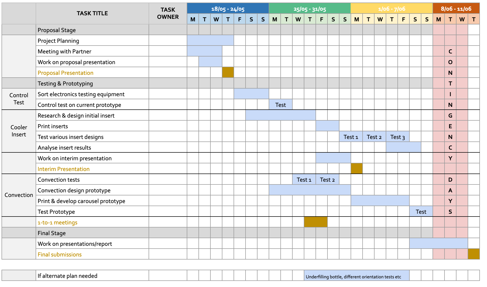

# Project management plan

## The people
Our group is made up of Karen, Kerry and Kavita:

Karen (mechanical/electrical engineer)
- Strengths: 3D modelling,3D printing, Drawing
- Weaknesses: Thermal modelling, Hardware

Kerry (mechanical/aerospace engineer)
- Strengths: Thermal/material knowledge, Mechanical design
- Weaknesses: Computational modelling, Electronics

Kavita (mechanical/electrical)
- Strengths: Electronics, 3D printing experience
- Weaknesses: Computational modelling

## The resources needed
| Resource | Cost | Source |
|---|---|---|
| PLA printer filament | £10–15 | CUED |
| Ice Bottle | £10 | RS Components |
| Temperature Sensors | £25 | Amazon |
| Arduino Wires | £0 | CUED |
| Laser Cut Wood (Offcuts) | £0 | CUED |
| Hot Glue Sticks | £1 | CUED |

## The timeline

## The assessment of the risks and safety
### Tooling Risks
#### Effect
* Burns from hot glue guns
* soldering burns, breathing in toxic fumes
* fire from laser cutter
* cuts and incidents from hand tools
#### Mitigation
* acquire appropriate training
* make sure fume hood on laser cutter is activated
* Keep hands and skin away from hot surfaces

### Electrical Testing Risks
#### Effect
* water contact with electrical components
* overheating of Arduino
#### Mitigation
* keep electronics away from water
* keep surfaces dry
* keep voltages and currents within working range

### 3D Printer Risks
#### Effect
* cuts from sharp components from 3D print
* high temperatures on 3D printer nozzle
* fingers or clothes getting caught in moving parts
* toxic fumes from print material
#### Mitigation
* maintain distance from 3D printer as it is operating
* use non-hazardous materials in 3D printer

## Contingency plans
